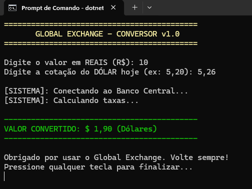
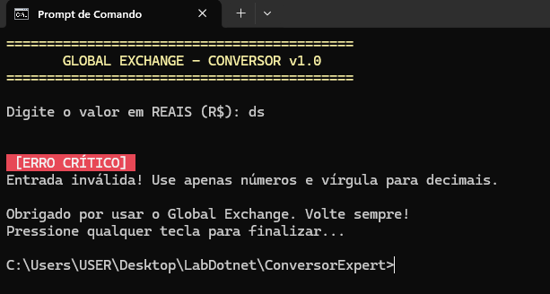

# una-ihcux-lista05

# O que o codigo utiliza
O `Program.cs` utiliza duas bibliote, System e System.Thereading, o codigo funciona para fazer a conversão de real para dolar, quando o usuario informa o valor em reais e a cotação do dólar, o sistema divide o valor é faz a conversão automaticamente. 
1. O usuario informa o valor em reais e a cotação do dolar, caso o usuario informe um valor diferente de um double, como uma string, o programa cai em catch, informando que a entrada está invalida
2. Caso o usuario tenha informado o valor corretamente, o codigo faz a conversão dividindo os valor e mostrando sempre duas casas decimais com `F2`.
3. Sempre no final do codigo, independente se deu erro ou não, é mostrado uma mensagem no final. 

## 📸 Evidência de Execução

## 📸 Evidência de Execução

